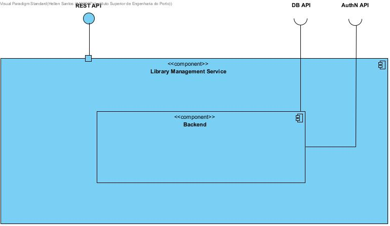
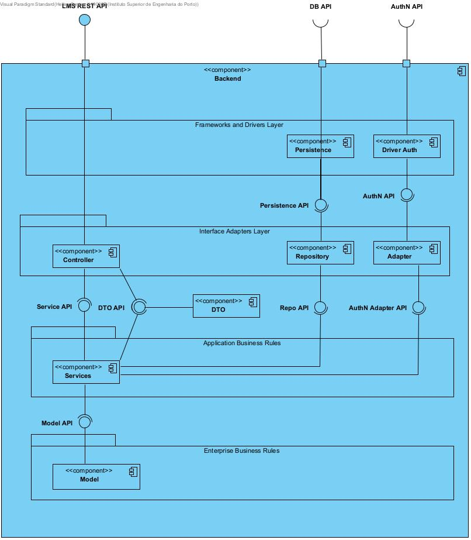
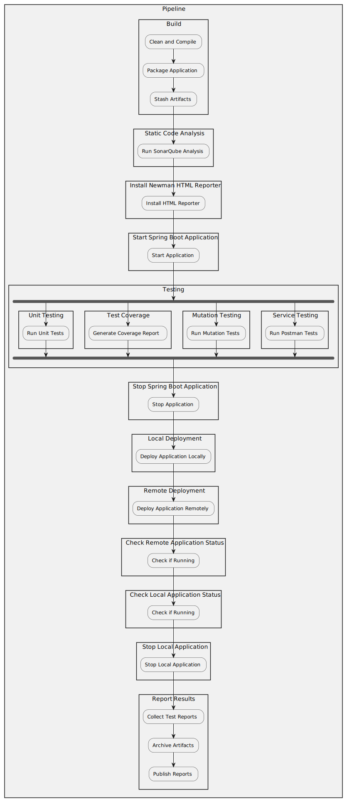
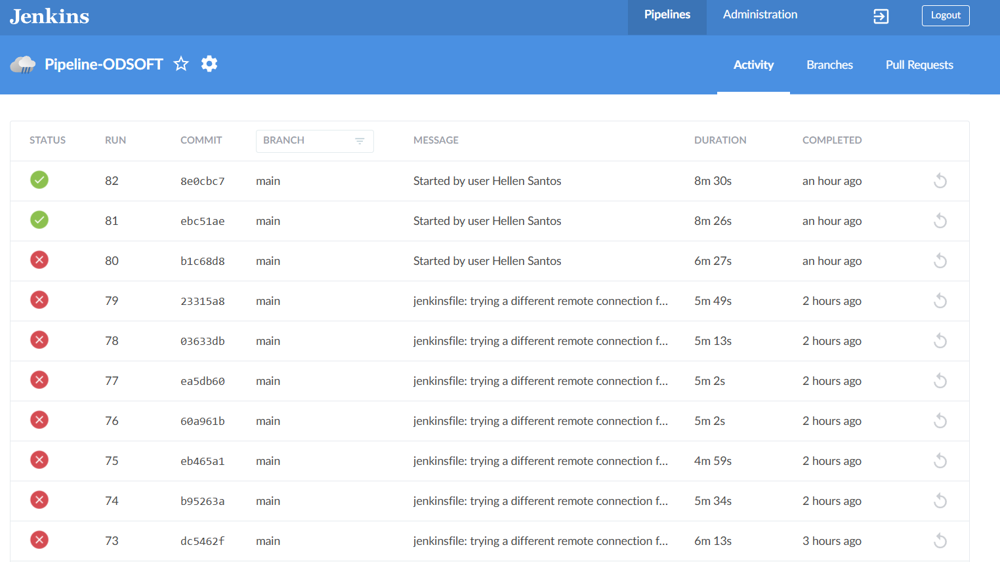

# ODSOFT - Project 1

## Students
* 1190007 - Hellen Santos
* 1190640 - Guilherme Cota

## Introduction
This project has the objective of adopting a CI/CD automation process using Jenkins that successfully builds, tests and deploys a Spring Boot application, as well to perform a critical analysis of its performance.

## System-As-Is (Reverse Engineering Design)

### Logical Views
#### Level 2

### Level 3

## Requirements - Pipeline Development
The requirements for the pipeline development are:
- Deployment of Jenkins 
  - Local 
  - DEI’s remote servers (e.g. hWps://vs-ctl.dei.isep.ipp.pt)
- SCM 
- Build 
  - Compile/Package (compilation, resolve dependency)
  - Artifact Creation (packaging)
  - Static Code Analysis (e.g. ES Lint, SonarQube)
- Unit Testing 
  - Run (different tests levels separately)
  - Test coverage 
  - Mutation tests 
  - Reporting results 
- Integration Testing 
  - Service testing 
  - Data base testing 
  - Reporting results 
- Deployment 
  - Local 
  - Remote server (e.g. hWps://vs-ctl.dei.isep.ipp.pt)

### Development

The fully developed `Jenkisfile` can be accessed [here](../../Jenkinsfile).

#### Build
- Purpose: Compiles the project and packages it into a JAR/WAR file.
- Steps:
  - Uses Maven to clean, compile, and package the project. 
  - Stashes the build artifacts (JAR and WAR files) for later use in the pipeline.

#### Static Code Analysis
- Purpose: Analyzes the code for potential issues using SonarQube.
- Steps:
  - Unstashes the build artifact.
  - Runs SonarQube analysis using the sonar-maven-plugin.

#### Install Newman HTML Reporter
- Purpose: Installs the Newman HTML reporter for generating the Service test reports later.
- Steps:
  - Installs the newman-reporter-htmlextra package globally using npm.

#### Start Spring Boot Application
- Purpose: Starts the Spring Boot application for integration testing.
- Steps:
  - Runs the Spring Boot application using Maven.

#### Testing
- Purpose: Runs the unit and integration tests.
- Substages: 
  - Unit Testing
  - Test Coverage
  - Mutation Testing
  - Service Testing

##### Unit Testing
- Purpose: Runs unit tests to verify the functionality of individual components.
- Steps:
  - Unstashes the build artifact.
  - Executes unit tests using Maven.

##### Test Coverage
- Purpose: Generates a test coverage report to measure the extent of code covered by tests.
- Steps:
  - Unstashes the build artifact.
  - Runs JaCoCo to generate the coverage report.

##### Mutation Testing
- Purpose: Runs mutation tests to evaluate the effectiveness of the unit tests.
- Steps:
  - Unstashes the build artifact.
  - Executes mutation tests using PIT.

##### Service Testing
- Purpose: Runs service tests using Postman collections to verify the application's API endpoints.
- Steps:
  - Unstashes the build artifact.
  - Executes Postman collections using Newman and generates an HTML report.

#### Stop Spring Boot Application
- Purpose: Stops the Spring Boot application after testing.
- Steps:
  - Stops the Spring Boot application using Maven

#### Local Deployment  
- Purpose: Deploys the application locally for further testing or development.
- Steps:
  - Copies the JAR file to a local deployment directory and starts the application

#### Remote Deployment  
- Purpose: Deploys the application to a remote server.
- Steps:
  - Transfers the JAR file to the remote server using SCP.
  - Starts the application on the remote server using SSH.

#### Check Remote Application Status
- Purpose: Verifies that the application is running successfully on the Remote Machine/Server.
- Steps:
  - Initialize Variables: Sets retry interval, maximum retries, and attempts counter. 
  - Use SSH Credentials: Uses the withCredentials block to securely use SSH credentials.
  - Check Application Status:
  - Unix: Uses ssh to check if the application process is running.
  - Windows: Uses plink to check if the application process is running.
  - Retry Logic: Retries the status check at intervals until the application is confirmed running or maximum retries are reached.
  - Error Handling: Throws an error if the application does not start within the expected time

#### Check Local Application Status  
- Purpose: Verifies that the application is running successfully on the Local Machine.
- Steps:
  - Checks if the application process is running on the Local Machine

#### Stop Application  
- Purpose: Stops the application if it is running locally.
- Steps:
  - Stops the application using Maven.

#### Report Results  
- Purpose: Collects and publishes test reports and artifacts.
- Steps:
  - Collects JUnit test reports.
  - Archives the build artifacts.
  - Publishes JaCoCo coverage report.
  - Publishes PIT mutation testing report.
  - Publishes Newman test results.

### Jenkins Plugins
To run this Jenkinsfile successfully, the following Jenkins plugins need to be installed:  
- Pipeline: Provides the ability to define Jenkins jobs with code.
- Git: Integrates Git with Jenkins.
- Maven Integration: Allows Jenkins to use Maven for building projects.
- NodeJS: Integrates Node.js with Jenkins.
- SSH Agent: Provides SSH credentials for use in Jenkins jobs.
- SonarQube Scanner: Integrates SonarQube with Jenkins for static code analysis.
- JUnit: Provides support for JUnit test reports.
- JaCoCo: Integrates JaCoCo code coverage reports with Jenkins.
- HTML Publisher: Publishes HTML reports in Jenkins.
- Stash/Unstash: Allows stashing and unstashing of files between stages in a pipeline.

## Analysis

### Pipeline Performance
In the next sections we will display the general analysis on the performance of our developed pipeline, running on a local Jenkins server.

We weren't able to run the pipeline analysis on the Jenkins running on DEI's remote servers, as we were unable to access them due to the constants time-outs errors (504 Gateway Time-out).

#### Build History

For checking the build history, we used the BlueOcean plugin to see a history of the last 10 pipeline executions. The pipeline was executed 10 times, with the last 2 executions being successful and the remaining 8, failed executions. 

*This Report was generated on 2024-11-03 at 20:42 and its analysis doesn't include any posterior runs.*

The failing executions were due to the Remote Deployment stage and the Check Remote Application Status stage were still being developed, and the last 2 executions were successful as they were the final versions of the pipeline with the Remote Deployment and Check Remote Application Status stages successfully fully implemented.

However, it noticeable how the Remote Deployed and Check Remote Application Status stages were responsible by the overall build duration increase, as before they being concluded, the pipeline was taking around 5-6 minutes to complete, and after they were implemented, the pipeline started taking around 8 minutes to complete.

With that being said, the Remote Deployment and Check Remote Application Status stages should be re-evaluated in order to identify if the 2 minutes increase is justifiable, or if there are possible bottlenecks and how to optimize them.

#### Monitoring Metrics
The Monitoring Plugin was installed on Jenkins in order to monitor the performance of the pipeline. The plugin provides a graphical representation of the CPU, Memory, and Disk usage of the Jenkins server.

The generated PDF report can be accessed [here](./Metrics_Report.pdf).

- Memory usage: 
  - "Memory Java usada": 279 Mb / 2,030 Mb
    This means the Java process is using about 13.7% of the available memory, which is generally acceptable. It indicates that the Jenkins server has sufficient memory available.
- CPU usage:
  "% CPU do Sistema": 3.21% 
  - Low CPU usage suggests that the Jenkins server is not under heavy load, which is a positive sign. However, if there are periods of high CPU usage, it might require further investigation.
- HTTP Sessions: "Número de sessões HTTP": 1 
  - Having a single HTTP session is normal as it indicates that only one user is currently accessing the Jenkins server - which in that case, it's "me" as a user on my own local machine that is accessing it during the report generation.
- Active Threads: "Número de threads ativas (Requisições HTTP correntes)": 0 
  - No active threads indicate that there are currently no ongoing requests. Which makes totally sense as the pipeline wasn't running during the report generation.
- HTTP Statistics: "Acessos: 28 acessos/min em 10 requisições"
  - This indicates an average of 28 accesses per minute with a reasonable response time. This, in company of high error rates or slow response times, that could indicate problems.
  - However, this metric can be misleading as it is based on the number of accesses and not the actual performance of the server, mostly because this was being counted during the development of the pipeline itself.
- Error Statistics: 
  - Erro: hudson.security.AccessDeniedException3: anonymous is missing the Overall/Read permission
    This error indicates that an anonymous user is trying to access something they do not have permission for. As this is running on a local machine, this error can be ignored as it is not a security concern.

#### Optimization

#### Applied Optimization Techniques
* **Workspace Caching**: Reduces the time taken to set up the workspace by reusing cached contents if the source code has not changed significantly.
* **Artifact Caching**: Saves time and resources by caching build artifacts (e.g., compiled binaries, build outputs) so that subsequent builds can reuse them rather than recompiling or regenerating them.
* **Parallel Stages**: Reduces the overall testing time by running different types of tests in parallel.
* **Conditional Execution**: Skips certain stages if they are not required for a particular build, reducing the overall build time.
* **Retry Logic**: Retries certain stages if they fail due to transient issues, improving the reliability of the pipeline.
* **Error Handling**: Ensures that the pipeline can handle errors and continue with subsequent steps or fail with a clear message in order to facilitate debugging.

#### Future Optimization Techniques Suggestions
* **Dockerization**: Containerizing the application and the pipeline stages can improve portability, reproducibility, and resource utilization.
* **Parallel Execution of Independent Stage**: Use more Parallel Execution, trying to identify and execute stages that are independent of each other in parallel to reduce the overall build time.
* **Incremental Builds**: Implement incremental builds to only rebuild the parts of the application that have changed, reducing the build time.
* **Automated Rollbacks**: Implement automated rollback mechanisms in case of deployment failures to maintain system integrity.
* **Artifact Versioning**: Implement artifact versioning to manage dependencies and to ensure traceability and reproducibility.

## Tests

Black Box and White Box tests were added to the overall project, as well as a new collection of acceptance tests on Postman.

The Black Box test can be checked here: [Black Box Tests](../../src/test/java/pt/psoft/g1/psoftg1/Blackbox.java).

The White Box test can be checked here: [White Box Tests](../../src/test/java/pt/psoft/g1/psoftg1/Whitebox.java).

The new Postman collection can be checked here: [Postman Collection](../AcceptanceTests.postman_collection.json).

All the pre-existent and newly added tests pass successfully.

## Other considerations
### Jenkins running on DEI's remote servers
Although we were able to first run and test the initial stages of the pipeline on DEI's remote servers, we were unable to access it as the pipeline implementation progressed due to the constant time-out errors (504 Gateway Time-out) that we were facing. 

This prevented us from installing the necessary Plugins on Jenkins, as even clicking on the Plugin Manager was taking too long, and when it worked, it wasn't able  to show any Plugins on the Marketplace.

However, we are confident that the developed pipeline would successfully run in the remote Jenkins instance if we were able to install the necessary Plugins, and well to configure the required Tools and create the necessary Credentials to it.

### Remote Deployment
During this Pipeline development, there were 3 different approaches to the Remote Deployment stage:

* Using Tomcat: 
  * The first approach was to deploy the application on a Tomcat server. This was 90% successfully done by using a remote Tomcat server instance running on DEI's servers. However, the deployment was not fully successful as the provided credentials (with manager-gui role) lacked the necessary role permissions to perform an automatic deployment.
* Using Heroku:
  * The second approach was to deploy the application on Heroku. This alternative, however, is paid and requires a credit card to be registered, so we decided on not using it.
* Using SCP:
  * The third approach was to deploy the application using SCP. This approach was successfully implemented and tested by sending the .jar file to a Remote Virtual Machine on DEI's servers.
  * This process mimics the deployment process to a remote server, and it was successfully implemented and tested by checking the .jar file was able to be sent and executed on the virtual machine.

The third option was the one we decided to keep in the final version of the pipeline, as it was the most reliable and the one that was fully implemented and tested.

### Postman Tests on Jenkins
Although both the pre-existent and new Postman collection of tests run successfully on Postman, when ran on Jenkins, the tests seems to fail on most of its Assertions.

Until the time of this report, we were unable to identify the root cause of the problem, but we will continue on investigating this issue.

## Conclusion
The developed pipeline successfully automates the build, test, and deployment processes of a Spring Boot application. The pipeline includes stages for compiling, testing, analyzing code quality, running unit and integration tests, deploying the application locally and remotely, and monitoring the application's status.

The pipeline was developed using Jenkins and integrates various tools and plugins to achieve automation and continuous integration. The pipeline was tested locally and partially on DEI's remote servers, with successful results in the local environment.

The pipeline performance was analyzed using monitoring metrics, build history, and optimization techniques. The pipeline showed good performance in terms of memory and CPU usage, with low resource consumption. The build history indicated successful and failed executions, with the failed executions due to incomplete stages. The optimization techniques applied to the pipeline included workspace caching, artifact caching, parallel stages, conditional execution, retry logic, and error handling.

The pipeline's future optimization suggestions include Dockerization, parallel execution of independent stages, incremental builds, automated rollbacks, and artifact versioning. These optimizations aim to improve the pipeline's efficiency, reliability, and maintainability.

The tests added to the project, including Black Box, White Box, Author Entity integration tests, and Postman acceptance tests, were successfully implemented and passed. The tests ensure the correctness and reliability of the application's functionalities.

The pipeline development process faced challenges such as remote server access issues, plugin installation problems, and Postman test failures on Jenkins. These challenges were addressed by adapting the pipeline stages, optimizing the pipeline performance, and investigating the root causes of the issues.

Overall, we both agree that the project's requirements were successfully delivered, as the pipeline was implemented as expected, and the project structure was well-defined. The pipeline automation process provides a foundation for future development and deployment of Spring Boot applications with continuous integration and delivery practices.